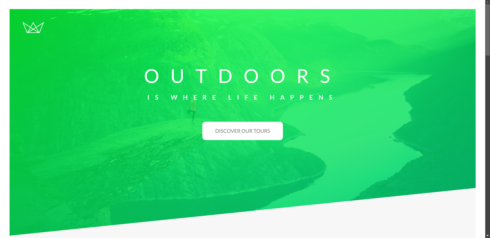

# Natours | Adventure Tours - Website

A modern, responsive website designed for showcasing adventure tours. This project was built using advanced CSS techniques and SASS, making the styling modular, reusable, and easy to maintain.

## ✨ Features

- **Responsive Design**: Looks great on mobile, tablet, and desktop.
- **Advanced CSS with SASS**: Styles are organized using SASS features such as variables, nesting, partials, and mixins.
- **Modular Layout**: Clean and structured design for easy navigation.
- **Tour Packages**: Highlighting different adventure packages with features and details.
- **Interactive Elements**: Hover effects and animations for better user interaction.

## 🛠️ Technologies Used

- **HTML5**: Markup for the webpage structure.
- **SASS (CSS Preprocessor)**: Used for managing styles in a structured and reusable way.
- **CSS3**: Advanced styling with flexbox and grid layouts.
- **JavaScript**: Basic interactions and animations.
- **Responsive Design**: Ensuring the website is functional across various screen sizes.
